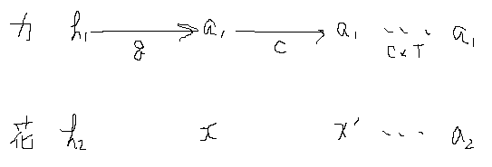

title: "Codeforces #305 (Div. 1) A"
date: 2015-06-09 22:18:57
tags:
- esplo77
- Codeforces
- C++11
---

# A. Mike and Frog

この回はかわいい絵付き。
やってることは簡単だけど、罠が多くてなかなか辿り着かない

## 問題

カエルと花は、初期状態の高さがそれぞれ$h_1$, $h_2$である。
カエルは$(x_1h_k + y_1) \mod m$、花は$(x_2h_f + y_1) \mod m$ ($h_k$, $h_f$は前の秒での高さ)に毎秒高さが変わってゆく。
カエルの高さが$a_1$かつ花の高さが$a_2$になる最小の秒数を答えよ。
永遠に条件を満たさない場合は-1を出力せよ。

$$
2 \leq m \leq 10^5 \\\
0 \leq h_1, h_2, a_1, a_2, x_1, x_2, y_1, y_2 < m \\\
h_1 \neq a_1 \\\
h_2 \neq a_2
$$

## 考え方

高さがどのような数列になるか考えてみると、必ず周期が発生することがわかる。
例えば、目的の高さがcだとすると、
- a, b, c, a, b, c, ....
- a, b, c, d, d, d, ....
- a, a, a, a, a, a, ....

などのパターンがある。
そのため、カエルや花の周期を求めて計算することで答えが求まる。

周期の最小公倍数を取る方法で行けそうだが、何故か通らなかったのでEditorialの方法でやってみる。



まず、カエルループの起点を$a_1$と考え、$h_1$から$a_1$に辿り着くまでの秒数を$q$とする。
これは、最大m回のループを回せば良い。
なぜなら、mod mで、ある高さから次の高さは一意に定まるからである。
ここで、$c$秒での花の高さが$a_2$であれば、$q$を出力して終わり。
$O(m)$。

次に、カエルループの周期を求める。
同様に最大m回のループを回し、$a_1$から$a_1$の秒数$c$を計算。
$O(m)$。

最後に、カエルループで$a_1$になる時、花の高さが$a_2$になる時があればそれを出力、なければ-1を出力して終了する。
これも同様に、最大m回$a_1$になるポイントをチェックすればよい。

### 最後のループ
普通にやると、カエルループは周期が$c$なので、m回チェックするということは$O(c \cdot m) = O(m^2)$になってしまう。
これでは間に合わないが、工夫して$c$秒後の花の高さがどうなるかを$O(1)$で求めることができる。

最初の花の高さを$h$とすると、2秒後の高さは以下のようになる。
$$
( x_2 \cdot ( (x_2 \cdot h + y_2) \mod m ) + y_2 ) \mod m \\\
= (( {x_2}^2 \cdot h + x_2 \cdot y_2 ) + y_2 ) \mod m
$$

modはいつ取っても同じなので、このような変形ができる。
結果、c秒後は以下のようになる。

$$
{x_2}^c \cdot h + ({x_2}^{c-1} \cdot y_2 + ... + y_2)
$$

これは、元の式$x_2\cdot h_2 + y_2$と形が同じ。
というわけで、今までのループと同様の処理を、$x_2$と$y_2$を上記の式の対応する値に変えて行えば$O(m)$でチェックできる。

## コード
```C++
int main() {
    cout.setf(ios::fixed, ios::floatfield);
    cout.precision(8);
    ios_base::sync_with_stdio(false);

    int m;
    cin >> m;
    int h1, a1, x1, y1, h2, a2, x2, y2;
    cin >> h1 >> a1 >> x1 >> y1 >> h2 >> a2 >> x2 >> y2;

    int q = 1;
    for(; q <= m+1; ++q) {
        h1 = ( (ll)x1 * h1 + y1 ) % m;
        h2 = ( (ll)x2 * h2 + y2 ) % m;

        if(h1 == a1)
            break;

        // not found
        if(q == m+1) {
            cout << -1 << endl;
            return 0;
        }
    }

    if(h2 == a2) {
        cout << q << endl;
        return 0;
    }

    //// 2nd step
    int c = 1;
    int aftX = 1, aftY = 0;
    for(; c <= m+1; ++c) {
        h1 = ( (ll)x1 * h1 + y1 ) % m;
        aftX = ( (ll)x2 * aftX ) % m;
        aftY = ( (ll)x2 * aftY + y2 ) % m;

        if(h1 == a1)
            break;

        // not found
        if(c == m+1) {
            cout << -1 << endl;
            return 0;
        }
    }

    // c * o
    rep(i,m+1) {
        h2 = ( (ll)aftX * h2 + aftY ) % m;

        if(h2 == a2) {
            cout <<  (ll)c * (i+1) + q << endl;
            return 0;
        }
    }

    // not found
    cout << -1 << endl;

    return 0;
}
```

## 結果
78 ms, 16 KB