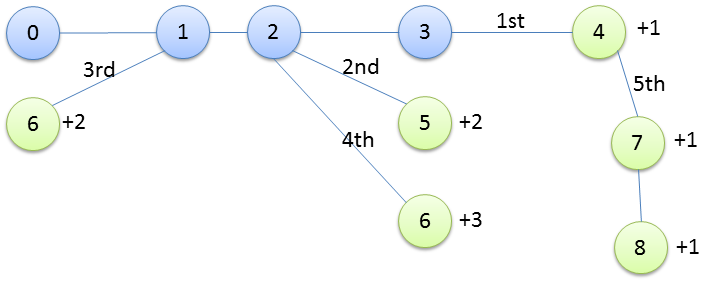

title: "TopCoder SRM 675 Div.1 Easy"
date: 2015-12-25 22:13:00
tags:
- esplo77
- Topcoder
- C++11
---

# TreeAndPathLength3
## 問題
[問題文](https://community.topcoder.com/stat?c=problem_statement&pm=14089)

## 考え方
適当にノードを追加していると、長さ3の個数が規則的に増やせるパターンが見つかる。
今回は、以下のようなパターンを見つけた。
サンプルとして、テストケース3を利用する。



エッジに記載されている序数は、それを追加した順番を表す。
また、ノードの右側に記載されている数値は、そのノードを追加した際に増加する長さ3の個数。

0～3は最初に用意し、まず4を加えて1にする。
次に、2から5を生やし、+2する。
続いて1から6を生やし、+2する。
また2から6を生やし、+3する。
…
このように、2と1から次々に生やしてゆくことで、二乗のペースで長さ3の個数を増やすことができる。
制約では$s \leq 10000$なので、1と2にそれぞれ100ほど増やすだけで達成できる。

微調整するには、4から伸ばしてゆく。
1つ追加するたびに+1される。
この長さは、s=10000、1から99個、2から100個生えている時が最大で、100個ほど伸びる。
この場合でもノード数は500を超えないので、問題の条件を満たしている。

```C++
class TreeAndPathLength3 {
    public:
    vector<int> construct(int s) {
        vi res = {0,1,1,2,2,3};
        if(s == 1)
            return res;
        res.emplace_back(3);
        res.emplace_back(4);
        if(s == 2)
            return res;

        int next_num = 5;
        int add_num = 2;
        int now = 2;

        while(true) {
            // right
            if (now + add_num <= s) {
                res.emplace_back(2);
                res.emplace_back(next_num++);
                now += add_num;
            }
            // left
            if(now + add_num <= s) {
                res.emplace_back(1);
                res.emplace_back(next_num++);
                now += add_num;

                add_num++;
            }
            else
                break;
        }

        next_num--;

        // remains
        rep(i, s-now) {
            if(i == 0)
                res.emplace_back(4);
            else
                res.emplace_back(next_num);
            res.emplace_back(++next_num);
        }

        return res;
    }
};
```

## まとめ
こんなにややこしいことをしなくても、[こちらのブログ](http://mayokoex.hatenablog.com/entry/2015/12/10/232044)ではより良い方法が紹介されている。
最初に妙な伸ばし方を試してしまったせいでややこしくなってしまった。
